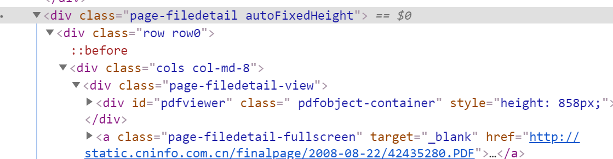

# 目的

-    python下载招股说明书
-    仿照财报下载ts00061

# 参考资料

1.   ts00061 
2.   如何批量下载 A 股招股说明书？ - Liu Cao的回答 - 知乎 https://www.zhihu.com/question/21872457/answer/152010418
3.   

# 笔记

-    直接用巨潮信息网站，用fulltextsearch关键字，然后抓取反馈信息中的PDF下载即可
-    [http://www.cninfo.com.cn/new/disclosure/detail?plate=&orgId=9900005238&stockCode=002271&announcementId=42435280&announcementTime=2008-08-22%2006:30](http://www.cninfo.com.cn/new/disclosure/detail?plate=&orgId=9900005238&stockCode=002271&announcementId=42435280&announcementTime=2008-08-22 06:30)
-    
-    问题：加载后缺少*.pdf字段，原因在于延迟加载？
-    成功
     -    